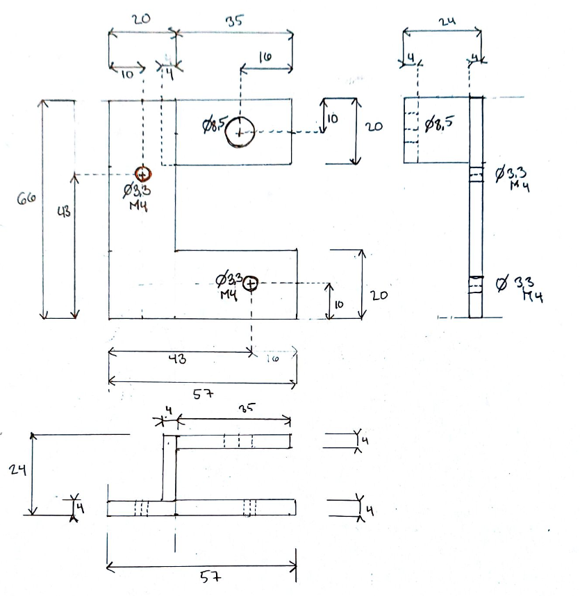
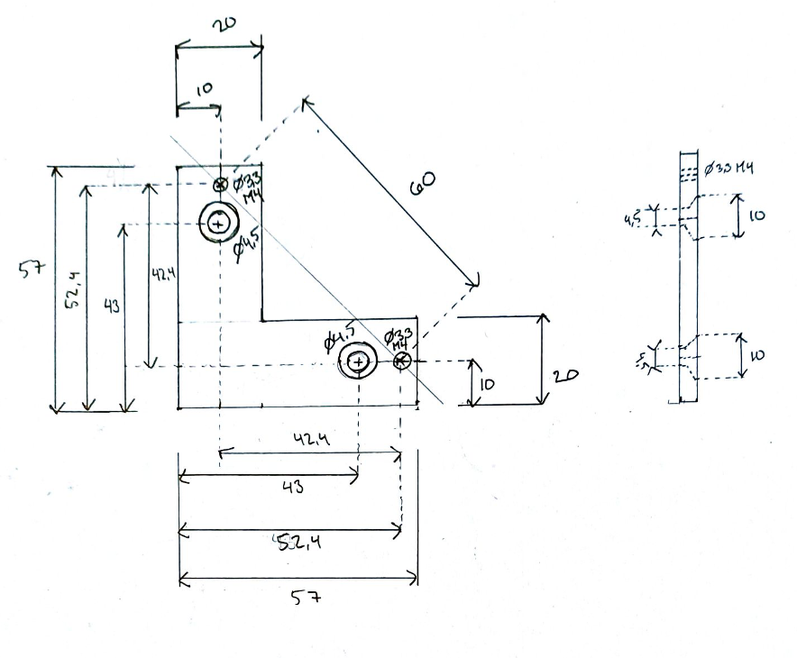

# Installing Defa Cabin heater in Volvo v60

I choose to not install the volvo kit, since I was only interested in the cabin heater and not 
the engine heater. However the instructions from volvo for installing the original parts was of 
great use, when it comes to locating the hole in the firewall to the cabin.

## Volvo original instructions (Entry cable, engine heater, cabin contact)
[Entry Cable](https://accessories.volvocars.com/sv-se/InstallationInstruction/Document/VCC-467547-4/V60)
[Compartment/cabin contact](https://accessories.volvocars.com/sv-se/InstallationInstruction/Document/VCC-461288-1/V60)

## My procedure

### Locating the hole through the firewall
First you need to remove the cover of the center console on the passenger side, it is held with 
4 larger clips, and 2 smaller tabs

Then you can pull the floor isolation back and retch with you hand under the second part of 
isolation. There should be a rubber plug that seals the passage. I used a sharp screw driver, 
scissor and plyer to make a hole the size of the plug through the second part of isolation. 
After that it was quite easy to remove the plug.

From the inside of the engine bay, the passage is located just above the steering axel, behind the 
lower part of the sound/heat isolation. The isolation in the engine bay is quite fragile. 
I unfortunately ripped mine, try to be more careful the I was.

### Installing cable
I choose to have my inlet in the plastic trim part below the left headlight, I thought this was the 
easiest way since it is easy to remove the trim when drilling the hole, and inserting the cable.

clips. Look at the Volvo original instructions and try to do something similar. The new universal 
rubber sealing that comes with the defa kit is to small for the passage on this car, I cut a hole 
through the original plug and reused it. I only used the standard cable of 1,5m. If you want more 
freedom in how you rout the cable you should buy the 2m or use an extension cable.

### Cabin Outlet
I ended up welding a bracket, similar to the one used in the Volvo original kit that mounts to the 
aluminum part in the center console. I also used this mount for grounding the cable. The bolt securing
the bracket to the center console should be torqued to 24Nm.

