# Overheating rear brake 🔥 
After a short 13km trip, I noticed a burnt, metallic smell. A quick inspection revealed that the right rear brake was extremely hot. I estimated the disc temperature at 150-200°C, the caliper was slightly cooler but still too hot to touch, and the aluminum rim reached about 70°C near the center. In contrast, the left rear disc was barely warm at around 40°C. Clearly, something was wrong with the right rear brake.

This 14-year-old car has 200,000km on it. I had recently replaced the rear brake pads and both EPB motors due to cracked mounting ears on the original units, completing this work just 10,000km before this incident. My initial hypothesis was that the issue related to the EPB motor replacement. The new motors were from ABS rather than the original manufacturer TRW, so I suspected there might be a specification difference causing insufficient retraction, which would result in the brake pads maintaining slight contact with the rotor.

## EPB system on the V60
The parking brake system is relatively simple: a motor drives a screw that extends a pressure nut, which pushes on the piston and subsequently the brake pads against the rotor. The motor itself is not particularly "intelligent" - it's a basic DC motor that spins in one direction when 12V is applied, and reverses when the polarity is reversed. The motor connects directly to the PBM (Parking Brake Module) with only two wires, so there are no sensors or communication between the PBM and motor. These two wires only supply voltage when applying or releasing the parking brake.

The PBM monitors the motor's current draw. When the brakes begin to engage, increased resistance makes the motor work harder, causing current to spike. This is how the PBM knows the parking brake is fully engaged. I'm uncertain how the PBM determines when the parking brake is fully disengaged upon release - I assume it applies voltage for a predetermined time period that should be sufficient for brake disengagement, and likely monitors current draw to detect motor faults.

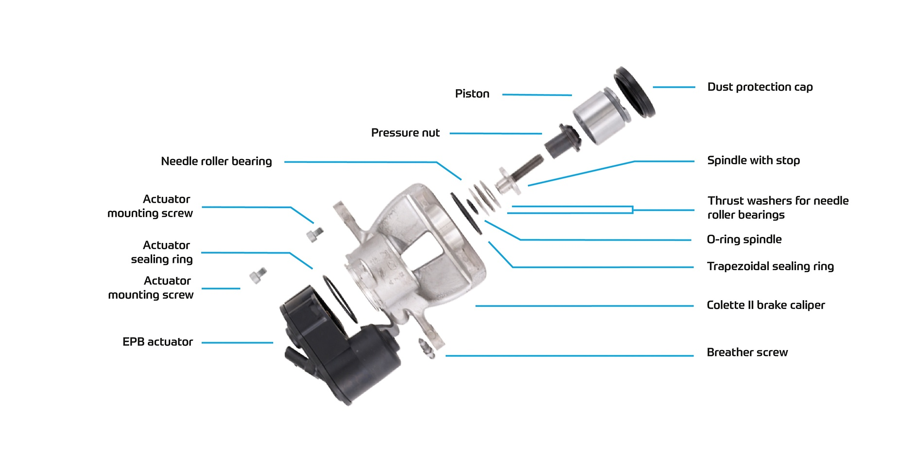

Since ABS is a budget brand compared to TRW, I suspected the EPB motor might not meet the original specifications or could have quality issues that caused slower operation than the original motor. If this were the case, the parking brake might not fully release since brake retraction is purely time-based, with no sensor to confirm that the parking brake has actually disengaged.

## Testing the hypothesis that the epb motor is bad
Here I just disconnected the cable to the epb motor and applied a voltage with a bench power supply, to screw the pressure not further back. I also made sure that there was not a problem with brake pads or caliper not sliding properly and then made a short test drive. The result was disporting, the rear right still overheated. I can't blame the cheep ABS motor and I would need to spend a lot more time investigating rather than just buy a new motor.

## Possible causes why a brakes would not disengage
- Park brake not retracting (already ruled out)
- Internal caliper parts are damaged due to dirt, rust, or age (most likely)
- Rubber brake lines have deteriorated due to delamination
- Stuck actuators or dirt inside the BCM (Brake Control Module) 

### Bad Caliper
The most probable cause for a piston not retracting is dirt or rust inside the caliper or around the piston. It's also likely that the sealing ring is no longer functioning properly due to age.

Brake fluid is hygroscopic, meaning it absorbs moisture over time. When the water content becomes too high, it can corrode internal caliper components and the piston. The rear caliper on the V60 is made of aluminum, so it won't corrode the same way as a cast iron caliper, but aluminum still oxidizes. Oxidation and dirt in the seal groove, or a corroded piston, can cause the piston to jam and fail to retract properly. This is why it's important to change brake fluid regularly (every 1-2 years) and ensure the outer seal/dust boot remains intact to protect the exposed portion of the piston.

Over time, the main seal (trapezoidal sealing ring) that grips the piston can deteriorate and lose elasticity. The seal's elasticity is what causes the piston to retract. Under normal operation, the piston doesn't slide within the seal. When you apply brake pressure, the seal twists slightly, allowing the piston to travel approximately 0.1-0.2mm before sliding within the seal. When you release the pressure, the seal's elasticity springs back, retracting the piston the same distance of 0.1-0.2mm.
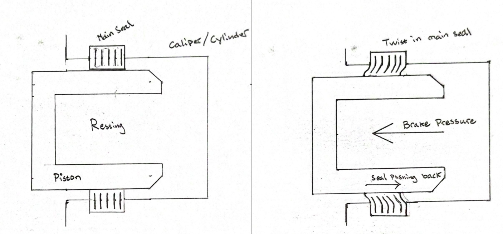

### Bad brake hose
The V60 has two rubber brake lines on each rear side connecting the caliper to the BCM. The first line connects directly to the caliper, while the second is positioned between the rear control arm and chassis to accommodate suspension movement. These brake hoses have multiple internal layers that can deteriorate over time.

With age or physical damage (such as pinching), the inner layer may delaminate and restrict brake fluid flow, creating a one-way valve effect. This restriction doesn't affect brake application because the hydraulic pressure is very high during braking. However, the much weaker retracting force generated by the main seal in the caliper cannot overcome this resistance in the brake hose, preventing the brakes from fully disengaging.

**Testing for brake hose restriction:**
1. Pump the brake pedal 3-5 times to build pressure
2. Open the bleeder valve on the caliper
3. If brake fluid squirts out forcefully (rather than just dripping), there's trapped pressure in the lines between the master cylinder and caliper

To isolate the problem:
1. Repeat the pressure test, but disconnect the brake hose from the brake line instead of opening the bleeder valve
2. If fluid doesn't squirt out at this connection point, you've identified a faulty brake hose that's holding pressure

[Video example](https://www.youtube.com/watch?v=mtRzC4s9lFM)

### Stuck actuators / dirt in BCM
The BCM continuously monitors the wheel speed of each wheel and actively works to improve vehicle handling. It assists with traction control, understeer/oversteer correction, automatic braking (City Safety), ABS, and other safety systems. The BCM accomplishes this through actuators that open and close valves to hold, decrease, or increase brake pressure to each wheel independently.

**Example of how the ABS system works:**
1. **Open mode (pressure build-up):** During normal braking, ABS is inactive. The intake valve (V1) remains open, allowing brake pressure from the pedal to transfer directly to the caliper.
2. **Pressure maintenance (pressure holding):** If the BCM detects a wheel rotating too slowly, it activates an actuator to close valve (V1). This blocks the passage from the master cylinder to the caliper, preventing brake pressure from increasing even if you press harder on the brake pedal.
3. **Pressure reduction:** If wheel rotation speed continues to decrease relative to vehicle speed, the BCM opens valve (V2) and activates a hydraulic motor to pump brake fluid from the caliper, reducing brake pressure. Once the wheel's rotational speed increases sufficiently relative to vehicle speed, the BCM returns to open mode.

Steps 1-3 repeat until braking is complete.

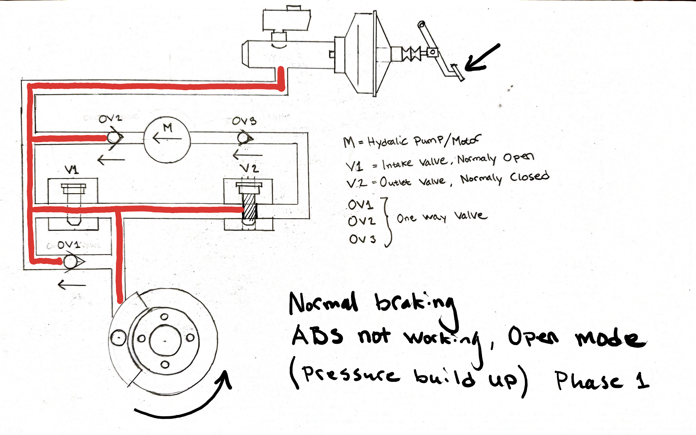
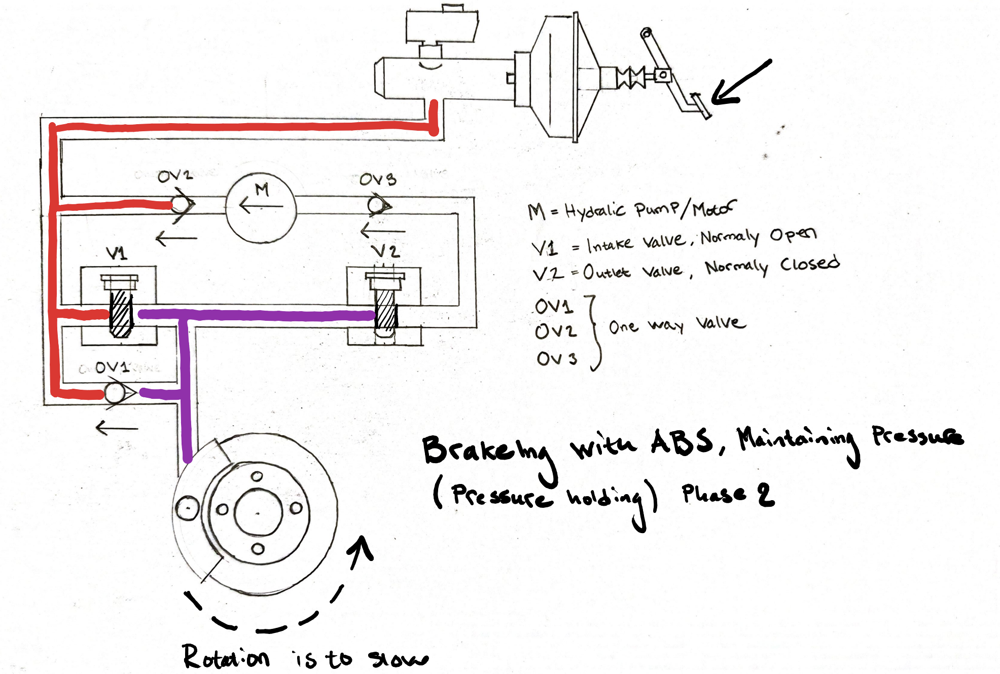
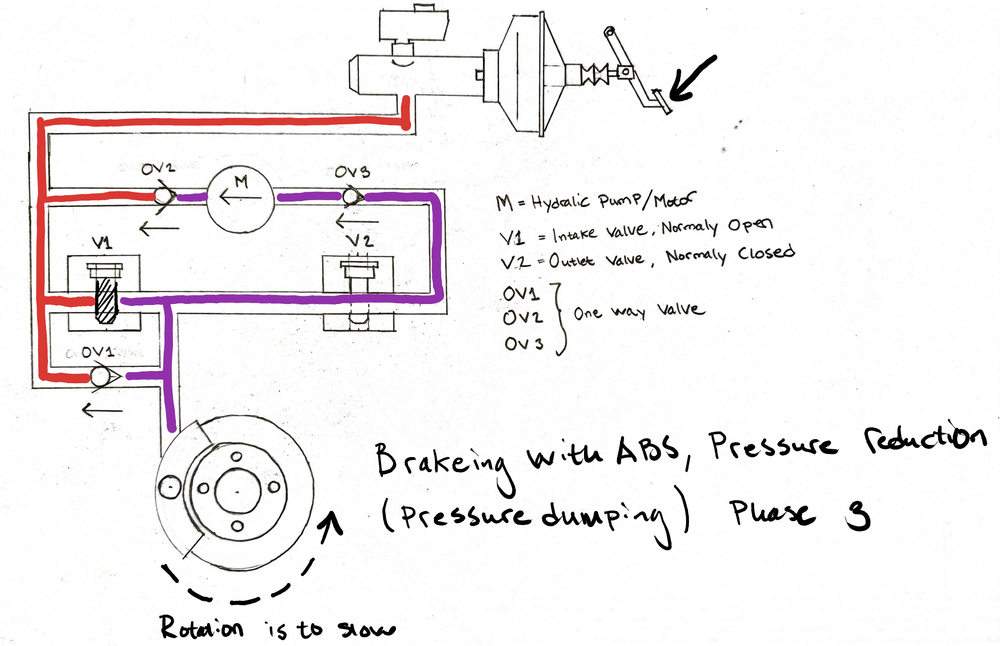

These illustrations show a simplified version of how the ABS system works for one wheel. In reality, there are actuators controlling each wheel individually, plus additional actuators for automatic braking and traction control. More detailed information can be found in Volvo VIDA under Design and Function → Brakes → Brake control system → Anti-lock brake → Brake control module → Function.

While I haven't found extensive documentation about dirt or stuck valves causing brake pistons to fail to retract properly, it seems plausible. For example, if we're in open mode and valve (V1) becomes stuck in a nearly closed position, or if the one-way valve fails to open properly, the retracting force generated by the main seal might be insufficient to overcome the increased resistance. This scenario might not trigger fault codes since the valves are mechanical components with no position feedback to the BCM. This would be the final area to investigate after ruling out all other causes.

## Rebuilding the caliper and replacing brake hose 
The next step in the troubleshooting process is to rebuild the caliper with new seals and a replacement piston. This approach is significantly cheaper than purchasing a new caliper, though it does require more time and effort. I also ordered a new brake hose, which is relatively inexpensive.

| Name | OEM nr | Trodo article number | Brand | Info |
|------|--------|---------------------|-------|------|
| Piston 233856| ??? | 16661 | Budweg | 38mm replacement piston for TRW system |
| Repair kit caliper 203863 | ??? | 16388 | Budweg | 38mm seal repair kit for TRW system, including dust covers for slide pins |
| Brake hose left | 31317431 |  |  | Did not order |
| Brake hose right | 31317430 | 284858 | BOSCH | Length 330mm, Included M10 banjo bolt with 2 aluminum pressure washers |
| New Caliper right | 36001381 |  |  | Did not order, original manufacturer TRW |
| New Caliper left | 36001375 |  |  | Did not order, original manufacturer TRW |
| Bleeder screw | 30742501 | 927619 | QUICK BRAKE | M10, Length 30mm |

### Removing the caliper and brake hose from the car
- If time permits, clean and soak the bleeder screw, banjo bolt, and brake line connection in rust penetrating fluid for as long as possible. I waited 1 day and reapplied penetrating fluid 3 times before attempting to loosen any fasteners.
- Remove the wheel (5x 19mm bolts, torque specification: 140Nm)
- Disconnect brake hose from brake line (wrench size??, torque specification: 14Nm)
- Place a dust cap from the bleeder screw on the end of the brake line to prevent brake fluid spillage
- Remove the metal clip securing the brake hose in place
- Pull the brake hose out of the bracket - only rust and dirt hold it in place
- Remove brake hose from caliper (socket??, torque specification: 46Nm)
- Remove the bolts connecting the caliper to the slide pins (13mm socket + 15mm wrench, torque specification: 35Nm)
- Slide the caliper off
- Disconnect the EPB motor power cable using a flathead screwdriver to press and release the internal latch

**Note:** The brake hose contains a "location pin" that may become stuck inside the caliper and snap during removal. If this occurs, drill it out using a 4.5mm drill bit.
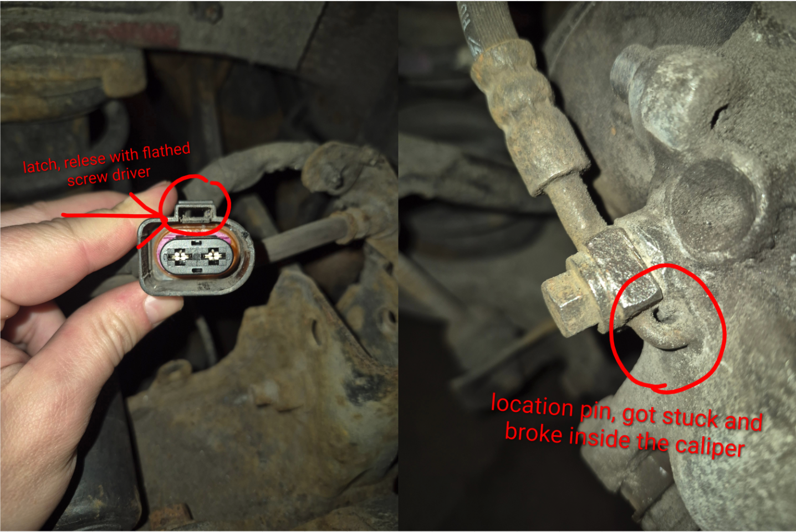
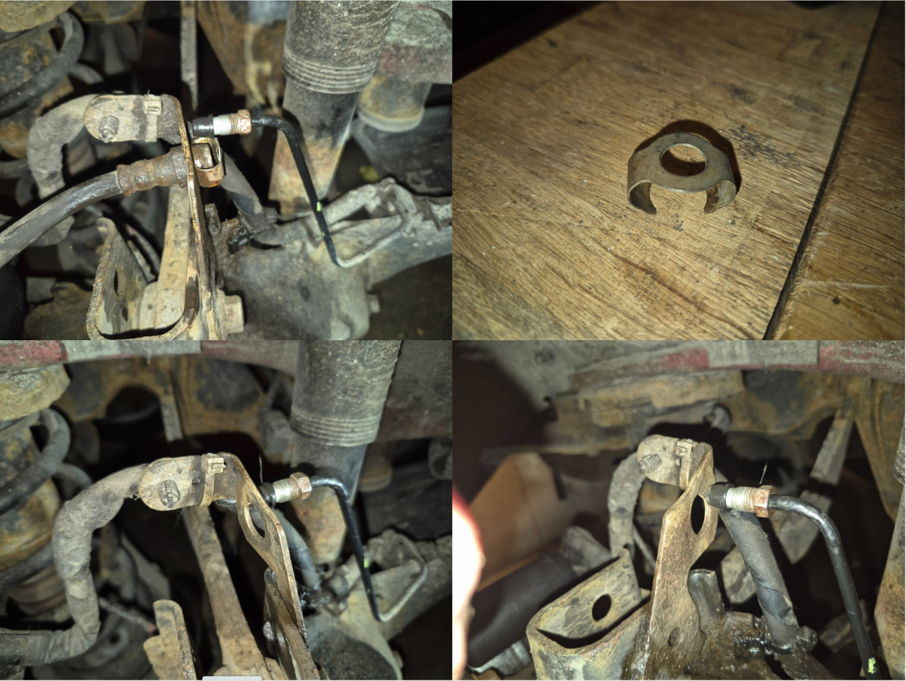

### Disassemble caliper
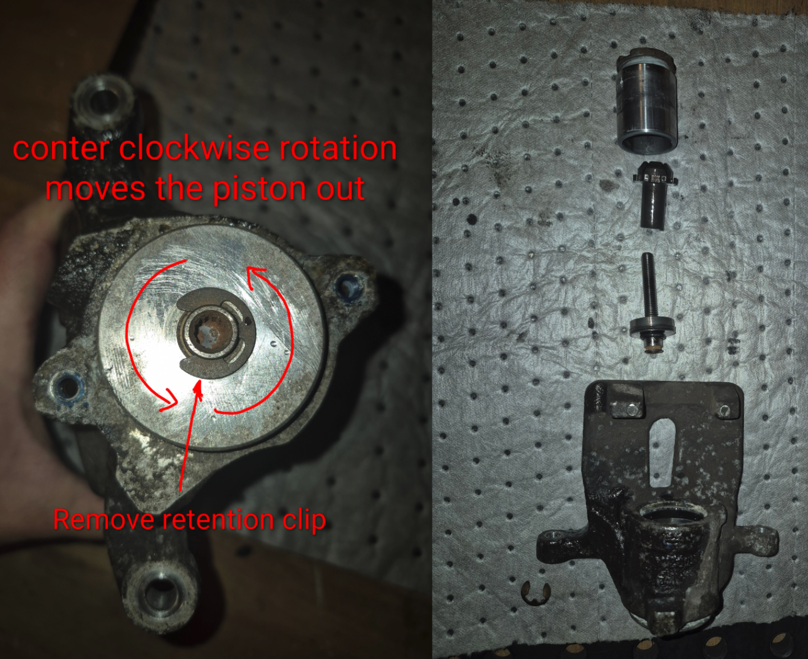
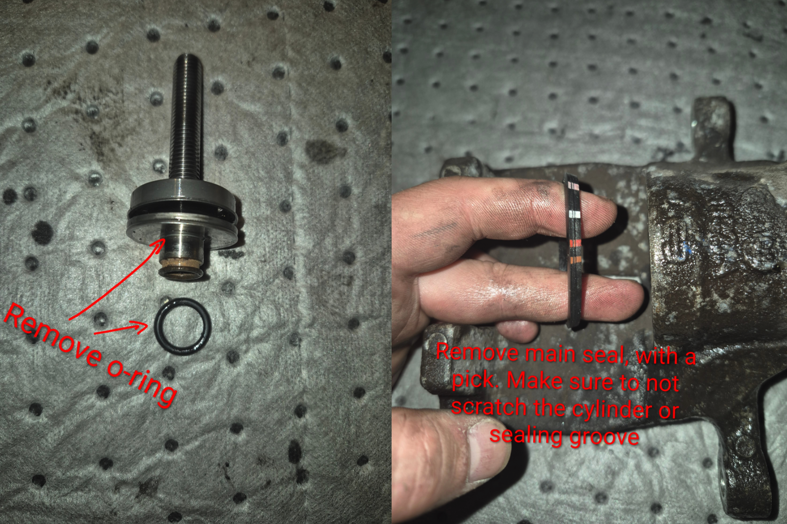

### Cleaning the caliper
I soaked the caliper in a bucket of 10% alkaline solution for a couple of hours, then cleaned it with a wire brush on the outside and a nylon brush inside the cylinder. Avoid using acids like citric acid on aluminum components, as they can potentially etch the cylinder bore and affect tolerances. The most critical area to clean thoroughly is the groove for the main seal and dust boot - ensure it's completely free from gasket residue and oxidation.
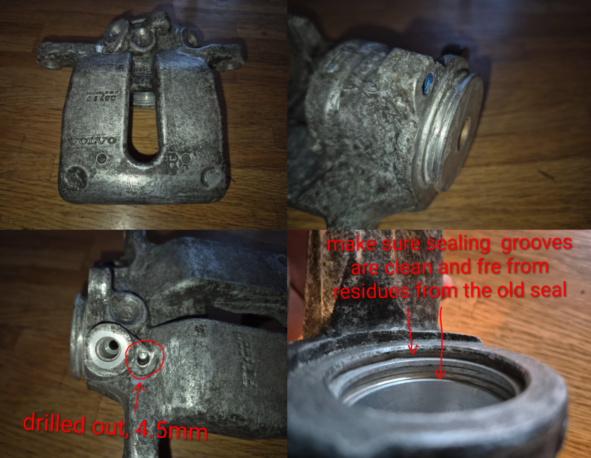

### Rebuilding the caliper
- Install a new main seal inside the caliper and press it firmly into the groove
- Install a new o-ring on the back of the screw/spindle
- Insert the screw/spindle and press it firmly to the back of the caliper while installing the retainer clip
- Slide the dust boot over the back of the piston. Light lubrication helps, but too much makes it difficult for the dust boot to stay on the piston during installation
- Lubricate the main seal generously with brake fluid. Avoid lubricating the groove for the dust boot, as it makes it harder for the dust boot to stay in place
- Thread the pressure nut all the way into the caliper 
- Carefully align the piston with the pressure nut while ensuring the dust boot lip seats properly in the caliper groove. Take your time with this step. A T40 bit helps to rotate the screw and nut from the back of the caliper
- Push the piston inside the cylinder. Hand force should be sufficient - if more force is needed, something is wrong
- Slide the outer lip of the dust boot into the groove of the piston
- Visually inspect that the dust boot is seated correctly in the caliper
- Install the o-ring for the EPB motor
- Install the EPB motor and torque the hex bolts to 10Nm

**Tip:** Practice fitting without the dust boot first to understand how to align and press the piston. Never install the piston without the screw and pressure nut, as it can be very difficult to remove.

During assembly, the piston initially slides in easily but becomes difficult to push after pulling it out slightly. This happens because the seal wipes off the brake fluid lubrication on the first stroke. This isn't a concern during operation - the caliper will be filled with brake fluid for proper lubrication, and under normal braking the piston doesn't slide within the seal but moves with it.

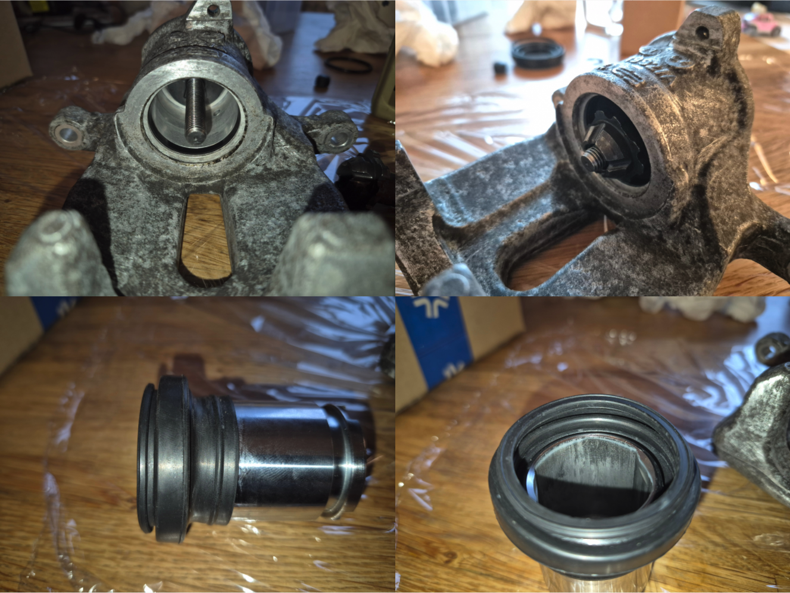
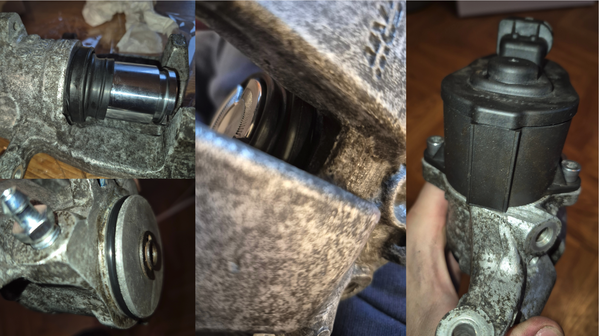

### Reinstalling the caliper
Installation follows the reverse order of removal. Before reassembly, clean and lubricate the slide pins with brake caliper grease, and apply ceramic lubricant to the brake pad sliding surfaces.
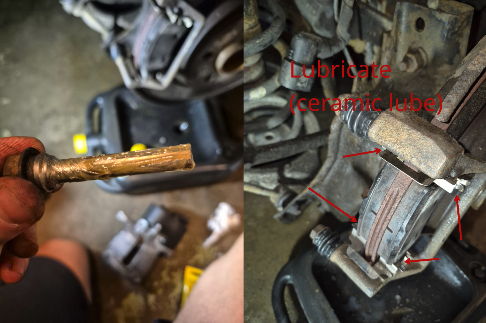

## Bleeding the system

### Preparation
- Remove all 4 wheels to access the bleeder screws
- Clean all calipers and soak bleeder screws in rust penetration fluid for as long as possible
- Test that all bleeder screws can be opened without breaking them
- Empty the brake fluid reservoir by sucking out the old fluid to avoid mixing old and new fluid
- Fill reservoir with new DOT 4 brake fluid

### Bleeding procedure
Start with the rebuilt caliper (which is completely empty), then follow the standard bleeding order: Front Left → Front Right → Rear Left → Rear Right.

**Important:** Keep the brake fluid reservoir topped up throughout the process - never let it run empty.

For each caliper:
1. Attach bleeding equipment to the bleeder screw
2. Open bleeder screw and pump brake pedal until no air bubbles appear
3. Continue bleeding until fluid runs clear

**Note:** While bleeding until air bubbles stop is sufficient, I recommend flushing a full 1L bottle of brake fluid through the system. This helps remove any dirt and ensures complete fluid replacement. Don't store opened brake fluid bottles as the fluid absorbs moisture and deteriorates.

## Inspecting the rotor/disc
A rotor can warp when overheated, so I wanted to check the runout to determine if the disc needed replacement. Using a dial indicator, I measured a runout of 0.08mm, which slightly exceeds the tolerance specified in VIDA of 0.075mm. However, since it's close to the specification, I decided to test the performance before purchasing a new rotor.
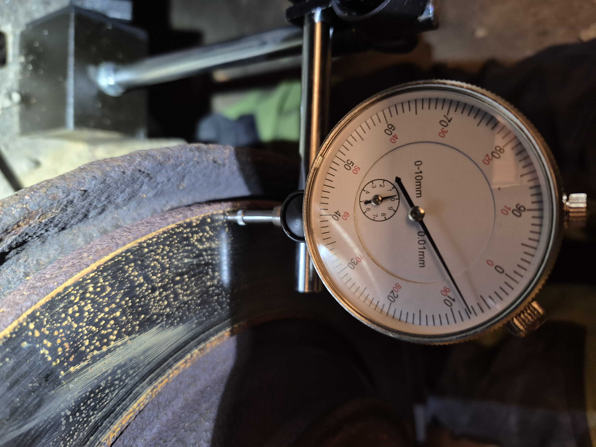

# Results
After rebuilding the caliper and flushing/bleeding the system, everything worked perfectly. The rebuilt right caliper now runs even slightly cooler than the left one after driving. I found no restrictions in the brake hose, so that replacement was unnecessary.

I believe the problem was related to the recent brake pad replacement, combined with a dust boot that had partially slipped out of its groove, allowing dirt and oxidation around the piston. When installing new brake pads, you must push the piston further into the caliper since new pads are thicker. This means the portion of the piston that had been exposed to dirt and oxidation (which may have altered the piston's tolerances) was now in contact with the main seal. This likely prevented the piston from moving properly with the seal. Additionally, the old seal may have lost elasticity over time, particularly when dealing with the altered piston tolerances.
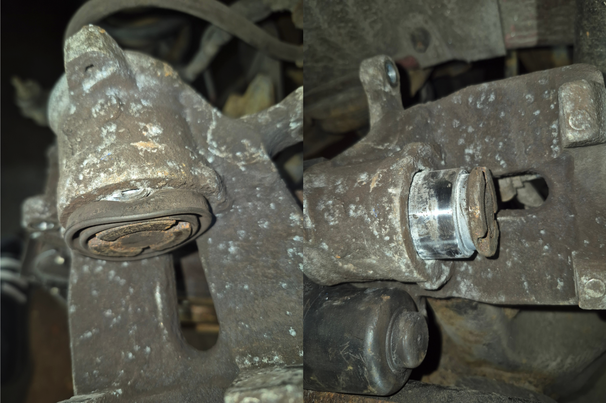