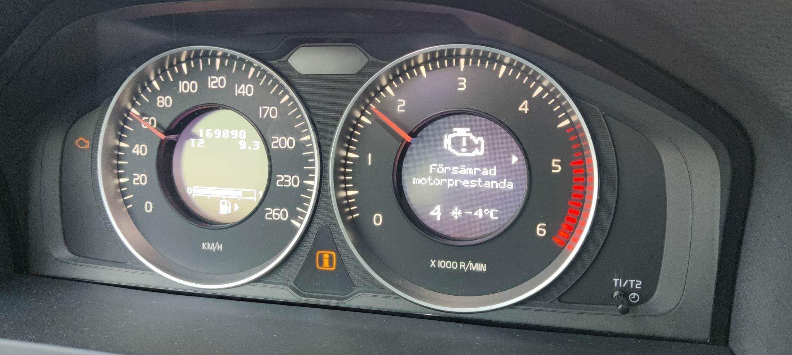
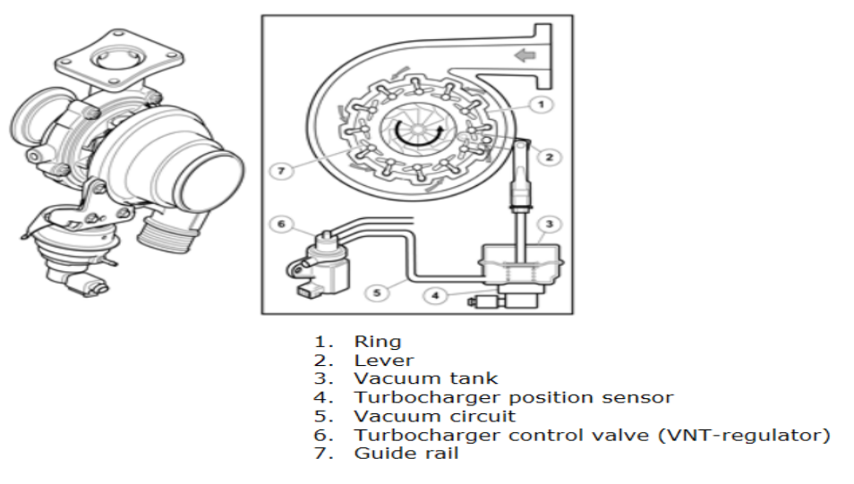

# Reduced Engine Power turbo related

The reduced engine power warning can occur for several different reasons, but in general it will have something todo with air, fule supply or a sensor that is trying to help the ECM to adjust any of the two. 

In this case there was a fault code ECM-P259800, which says: "Turbocharger Boost Control Position Sensor "A" Performance - Stuck Low.

## General information about the turbo on a Volvo v60 with engine d4162t

A turbo chargers job is to increase the amount of air the engine can use in the combustion. The more air, the more fule can be used to create a more powerful combustion. The turbo charger does this by letting the exhaust gases pass through a turbine, that in turn drives another turbine on the intake side. This increases the air pressure to the engine.

More air is good, but we need a way to control the charge pressure built up by the turbo. There are different techniques for this, one is to use something called a waist gate. In simple terms, the waist gate releases pressure on the hot side to reduce the speed of the turbine. On this Volvo engine a more modern technique is used called VNT (Variable Nozzle Geometry). They work by varying the angle of finns that the exhaust gasses passes through. The speed of the exhaust gases increases when the finns are in a narrow position, and decreases when they are in a wide position.

Narrow position = higher air pressure on the intake side.\
Wide position = lower air pressure on the intake side.

On the illustration bellow on number 3 we see a vacuum tank with a diaframe that is pulling/pushing on a rod that in turn is controlling the angel of the finns. The upper part of the vacuum clock holds a vacuum, and pushes the rod up. The lower part of the clock is connected via vacuum hoses to a control valve (6) that can apply a vacuum and pull the diaframe down. On the vacuum clock there is also a position sensor (4) that tells the ECM the position/angle of the finns. 

## Fault codes 
ECM-P259800\
ECM-P259900\
Both of these code is set when the ECM detects that the position of the finns does not match the desired position regulated by the control valve, and indicating that the fins are stuck in a narrow or wide position depending on which of these two codes.

Possible causes to this:
- The finns are stuck in the turbo charger
- The control rod is stuck
- Clogged or damaged vacuum hoses to or from the vnt regulator
- Damaged vacuum pressure sensor / vnt regulator
- Damaged position sensor in the vacuum clock

When these fault codes are set, the ECM is limiting the engine output to not overrevv the turbocharger, since we no longer can regulate the speed of the exhaust gases. Also no exhaust gases are recirculated for second combustion (EGR).

## Problem in this case
In this case the vacuum hose connecting the vnt regulator and the vacuum clock was no longer connected. Over time the inner diameter of the vacuum hose has become wider until it no longer has the friction to stay on the vacuum clock. Simple solution to this was to use a hose clamp or cable tie

