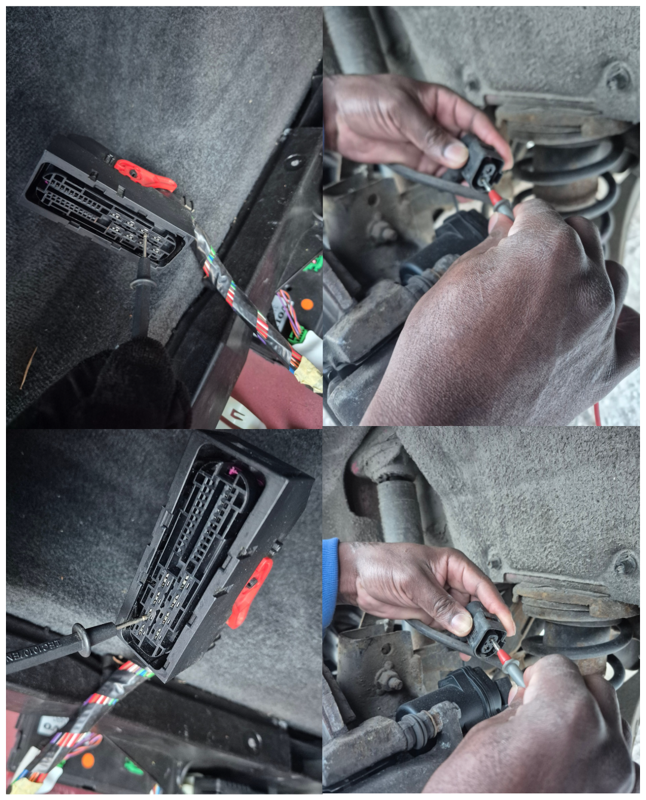
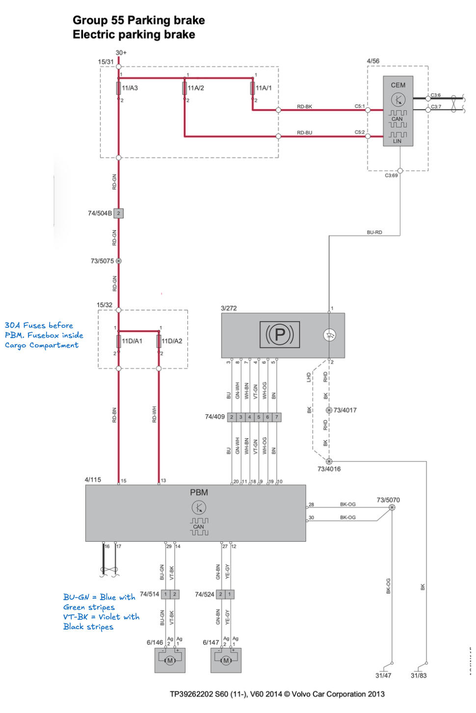
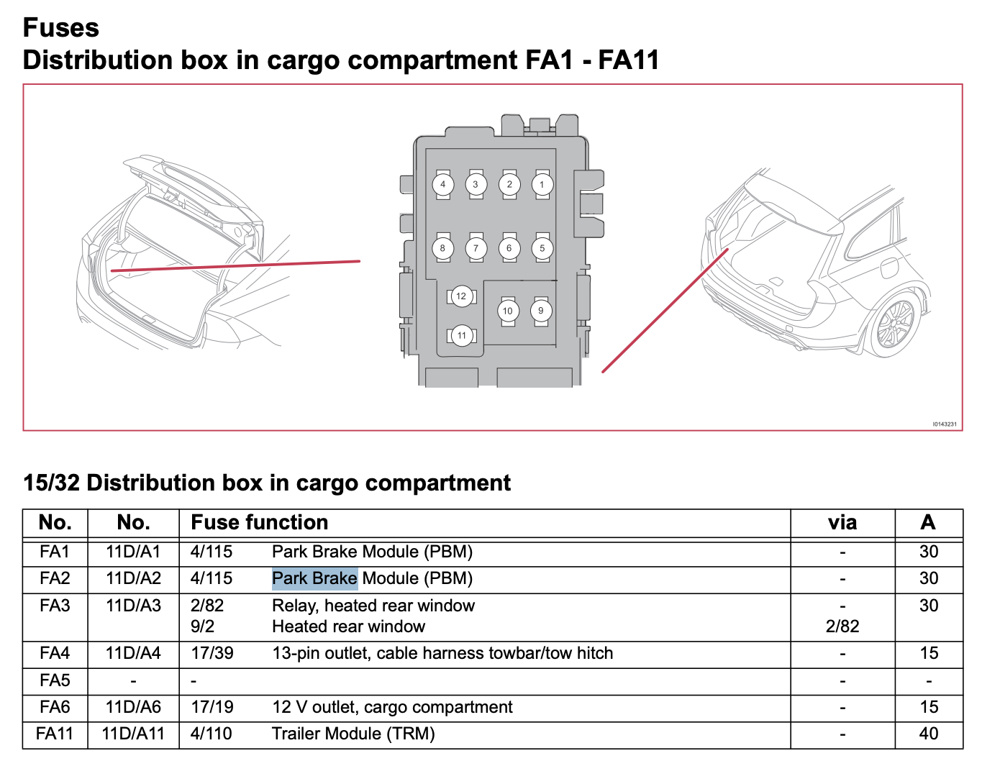
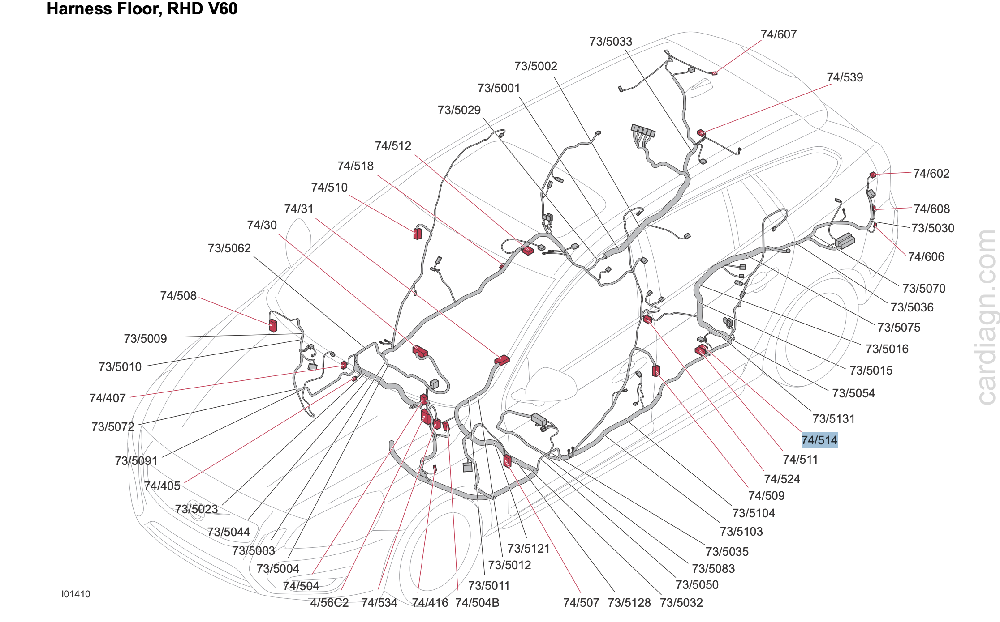
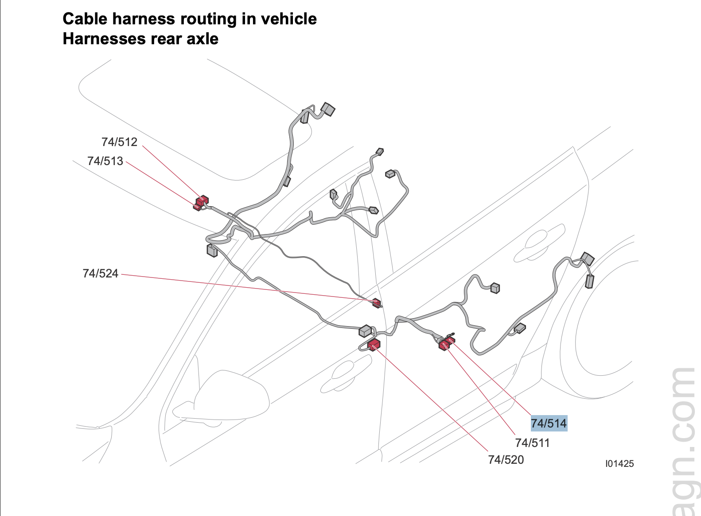
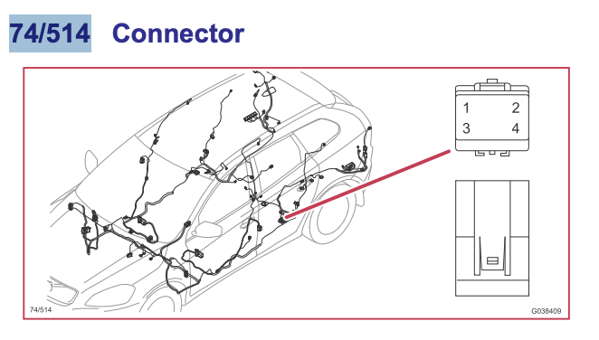
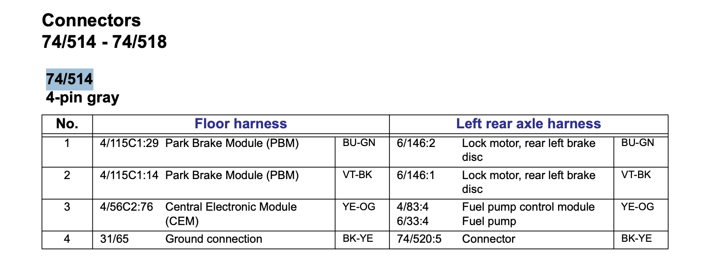
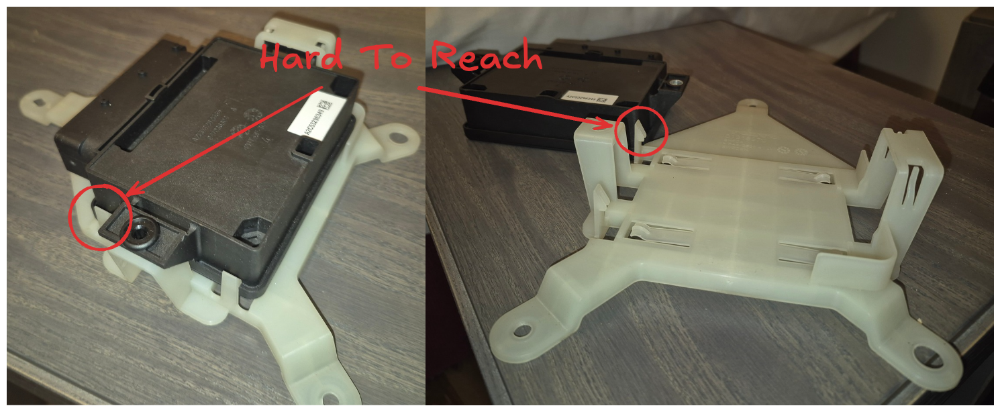

# Stuck electronic parking brake
During our cross-country ski vacation in Åre, Sweden, the temperature dropped to between -25 and -30 degrees Celsius, but I still wanted to ski. After pre-heating the car, I started driving to the tracks when I suddenly realized I had forgotten my glasses. I turned around and drove back to the cabin, which sits on a slight slope. I put the car in idle and engaged the electronic parking brake. Three minutes later, I tried to release the parking brake, but the system indicated that it had not fully disengaged. I tried multiple times to engage and disengage without any luck.

When engaging the parking brake, I received a yellow warning stating that parking brake service was required. When disengaging, I got a red warning light with the message "parking brake not fully released."

I drove the car approximately 50 meters to the nearest flat parking spot. Looking at the snow, I could see skid marks from the left tire, confirming it was indeed locked up. The right tire had released properly.

My hypothesis was that moisture in either the parking brake motor or the caliper had frozen due to the cold weather, locking the parking brake mechanism.

## Defrosting the caliper
Working entirely on the hypothesis that the parking brake mechanism was frozen, I brought out a heat gun set to 170 degrees Celsius and pointed it at the back of the caliper and parking brake motor. However, the heat gun struggled to reach even 70 degrees Celsius in the extreme cold. I increased the setting to 300 degrees with the same result. Finally, I maxed it out at 600 degrees Celsius, which turned out to be a terrible idea. At this temperature, it quickly heated up and began melting and deforming the plastic components of the parking brake motor.

After applying heat more cautiously, I managed to raise the temperature of the entire caliper to around 10 degrees Celsius. I tried releasing the parking brake one more time, but the result was disappointing. At this point, I was concerned that I might have damaged the motor with the heat gun.

## Removing the motor from the caliper
Using the emergency scissor jack and 19mm socket, I removed the tire and began unscrewing the hex bolts that hold the motor in place. To my disappointment, it was more or less impossible to fit a hex bit and wrench (even low-profile ones) onto one of the screws without first removing the caliper. Unfortunately, it's not possible to remove the caliper when the parking brake is engaged—a frustrating design flaw. Since I had a hacksaw blade in my toolbox, I decided to cut through one of the motor's mounting ears instead. This allowed me to remove the motor and manually unwind the spindle and pressure nut, releasing the parking brake.

Now I had a drivable car, but the system still believed the parking brake was engaged. It produced an extremely annoying beeping sound while driving that became even more frequent (about once per second) when traveling faster than 30 km/h. Driving the approximately 11-hour journey home to Gothenburg in this state with my partner and two small kids was simply not an option.

## Ordering a new motor
I ordered a new motor from Vparts, which arrived in less than 24 hours—impressively fast service from both Vparts and PostNord. Unfortunately, the new motor did not fix the problem, which indicated that the original motor was probably still functional. In hindsight, it would have been smart to test the old motor using the car's 12-volt battery and two wires. However, I didn't have any wires available at the time, and I was overly confident that the motor was faulty, so I didn't think it through.

## Diagnosis
At this point, I didn't know what the problem could be, but I suspected it might be one of the following:
- Motor calibration needed or error codes to clear
- Damaged cables or a short to ground
- Blown fuses
- Faulty PBM (parking brake module)

I ordered an iCarsoft diagnostic tool from Vparts—once again impressed by their service—and received it the next day. I also found a friendly local in Åre who was willing to lend me a multimeter. Additionally, I located all the wiring schematics for my V60 on [scribd.com](https://www.scribd.com/document/490826169/2011-S60-V60-39262202#page=1).

### OBD diagnosis
The icarsoft gave me the following codes:
```
Code: C200801
State: None
Left Motor. General Failure Information. General Electronic Failure.
```
and
```
Code: C200811
State: None
Left Motor. General Electrical Failure. Circuit Short To Ground.
```
### Electronic diagnosis
Starting with the easiest task, I checked that the fuses to the left motor were not blown. According to the wiring diagram, these would be 11D/A1 or 11D/A2, which are 30-amp fuses. Both were intact.

Next, I checked continuity for both wires from the PBM connector to the parking brake motor connector using a multimeter. This involved testing wire 29 (blue with green stripes) and wire 14 (violet with black stripes). However, to identify which pin in the connector corresponds to which wire, you need to unwind parts of the harness. Instead, I tested all the large pins capable of carrying high current until I found two that corresponded to the pins in the motor connector.

I also tested continuity to ground for these two pins, and neither was shorted to ground.

If I had not seen continuity or if any of the wires had been shorted to ground, I would have performed the same test at connector 74/514. This would have given me a better understanding of where the short or broken wire was located—most likely close to the swing arm, which is the only moving part that transfers movement to the cable harness.

The tests showed that there was no problem with the wiring that could cause a short to ground. This led me to believe that there was a short to ground inside the PBM module itself, and it would need to be replaced.





<table>
  <tr>
    <td></td>
    <td></td>
  </tr>
</table>

## Replacing PBM (Park brake module)
Whenever replacing a data module, you might need to perform a software download, especially if it's a new module. This can only be done by authorized Volvo repair shops with a valid online VIDA license. The closest location for this service would be Östersund, which is quite far, and they would likely not have new spare parts in stock.

The best option would be to order a second-hand unit and hope it doesn't require a software download. A software download isn't necessarily new software—it's more about car configuration. For example, an AWD vehicle might need different parameters for when to release the brake compared to a FWD vehicle, though that's just my assumption.

I found a second-hand unit that had belonged to a V60 of the same model year with the same engine and gearbox. In my view, these would be the most important parameters for a good fit that wouldn't require a software download.

Two days later, I received a PBM from Jönköpings bildemontering, which worked perfectly without any software download. An OBD diagnostic scan showed no errors for the PBM.

Removing the old PBM is quick but a bit tricky, as one of the plastic clips is difficult to find and reach before you can bend it out of its mount.
