# Volvo v60 2012 Base Service 
## Engine Specs 
|  |  |
| --- | --- |
| Code | D4162T |
| Volume | 1.6l |
| Naming | D2 / Drive |
| Cylinders | 4 |
| Fule | Diesel |
| Oil volume | 3.8l |

## Service items
| Item | OEM number / specs | Manufacture used by Volvo |
| --- | --- | --- |
| Engine oil | Edge 0W-30 A5/B5 (Ti) | Castrol |
| Oil filter | 9656432180 | Mahle |
| Air filter | 31370161 | Mahle |
| Compartment air filter | 31390880 | ??? |
| Copper sealing / oil plug | ??? | ??? |
| Disele filter | ??? | ??? |
| Break fluid | ??? | ??? |
| Coolant | ??? | ??? |

### Notes
- Volvo recommends engine oil ACEA A5/B5 SAE 5W-30, but when it comes to unfavorable circumstances Volvo recommends ACEA A5/B5 SAE 0W-30. If you live in Sweden or any other country with cold climate, then you are in the category of unfavorable circumstances.

## Service replacement intervalls
| Item | Years | kilometers | Note |
| --- | --- | --- | --- |
| Compartment air filter | 1 | 20000 | |
| Engine oil | 1 | 20000 | |
| Engine oil filter | 1 | 20000 | |
| Engine air filter | | 60000 | change only when mileage are reached | 
| Drain fule filter of water | 1 | 20000 | |
| Replace fule filter | | 60000 | change only when mileage are reached. In markets with bad contaminated fluid, change every 10000 - 20000 km |
| Accessory Drive Belt | 10 | 240000 | |
| Timing belt | 10 | 140000 | |
| Brake fluid | 2 | 40000 | If the car is used in humid environment or used for mountain driving replace every year |
| Cleaning windscreen in front of active safety / collision detection sensor| 1 | 20000|

## Volvo Originalservice Classic
This is service for Volvo cars that are older than 6 years, and it contains the following items / procedures:

- Check exterior lighting
- Function test signal horn
- Check and adjust parking break
- Change engine oil and filter
- Check and measure wear on tires
- Check air pressure inside tires
- Check drive shafts play and gaiters
- Outer inspection of engine, gearbox and final drive, check for oil leak and contamination
- Check wear on brake pads
- Inspect fule and break tubes, check fro leakage
- Drain / replace fule filter
- Check wear on steering and front carriage
- Check wear on cardan shaft and support bearing
- Check wear on rear carriage
- Check condition on exhaust system
- Check level of coolant or replace, also calculate coolant cold resistance
- Check oil level of steering servo
- Refill windscreen washer fluid
- Check charging of the battery
- Check level of distilled water in battery (only applies for older batteries not AGM)
- Check that the battery is fixed in position and that the terminals are clean

## Lifting points
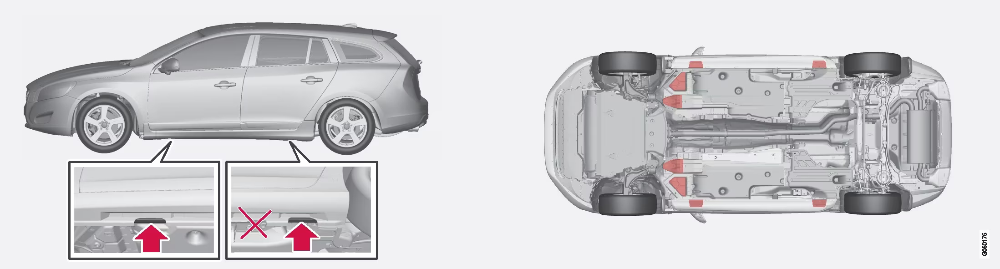
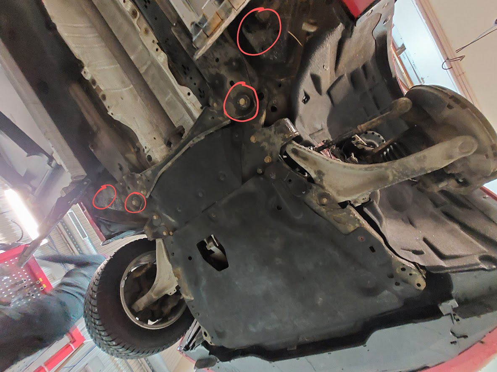
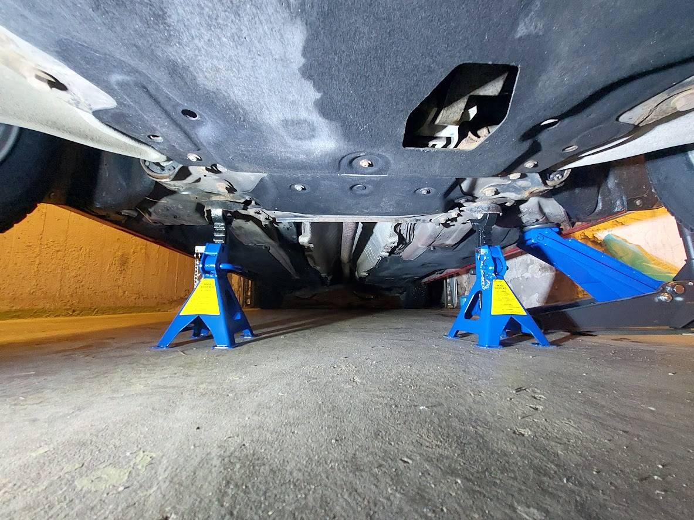

## Replace air filter
- Remove hose connecting the air box with the engine, (hose is fixed with two hose clamps)
- Remove Connector to the air mass sensor 
- Open the air box by unscrew all the trox screws
- Remove old filter
- Clean the air box compartment 
- Insert new air filter
- Close the lid, and cross tighten the trox screws to prevent stress on a single point
- Reinstall connector and hose

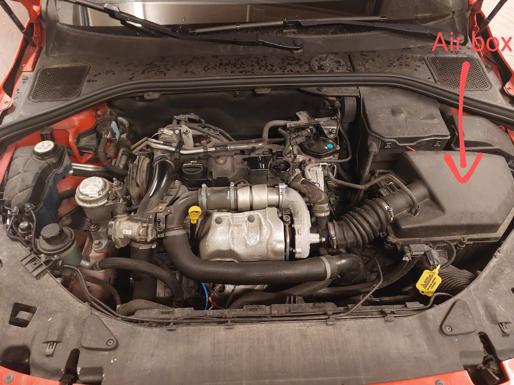
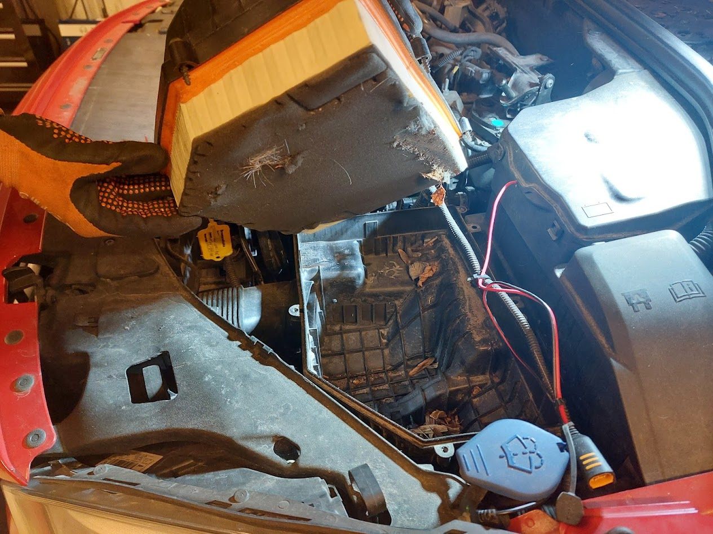

## Engine oil and filter replacement
The Engine should not be cold when performing this step, but it should not be to hot either, then you might get burnt when draining the oil. If the engine is cold, run the car for 3-6 min, this is enough. This will make the oil less viscous, and it will be easier to drain it.

This part is good to do after removing the air filter and before installing the new one, since we need to remove part of the air box to access the engine oil filter.

Remember to always use a new copper seal, when installing the oil plug. It is not necessary to use a new screw unless the old one is damaged. 

- Remove the engine cover (just pull, no screws)
- Remove the hose connecting the air box and the engine
- Add some paper under the oil filter cap (there will drop some oil)
- Unscrew the oil filter cap slightly 27mm socket (not all the way, just so that air can flow, when we remove the oil plug and drain the oil.
- Remove the fill cap (same reason as the step before)
- Lift car upp
- Remove cover by unscrewing all torx screws
- Remove oil plug and drain oil, The oil will flow directly once the oil plug is removed (tip use a magnetic stick and hold under the plug to catch it when it falls)
- Insert oil plug with new sealing, torque to 35 Nm
- Reinstall cover
- Lower the car down
- Fully remove the oil filter. be prepared with some paper, oil will drop from the filter.
- Remove the filter from the filter cap, this can require some force. The filter should just be pulled straight out of the cap.
- Remove the old sealing from the filter cap
- Apply some engine oil on the new sealing and put it on the filter cap
- install the new filter in the engine, and torque it to 25 Nm
- Add new oil. The engine holds 3.8l, but the filter also has some capacity. Therefore fill 3.9 to 4l of oil.
- Install the fill cap (important, don´t start the engine before this step)
- Start the engine and let it run for 1-2 min
- Check the oil level, and add more oil if needed

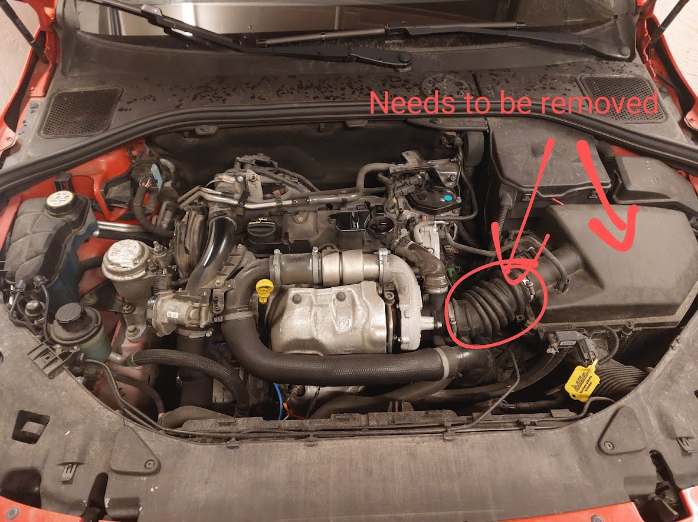
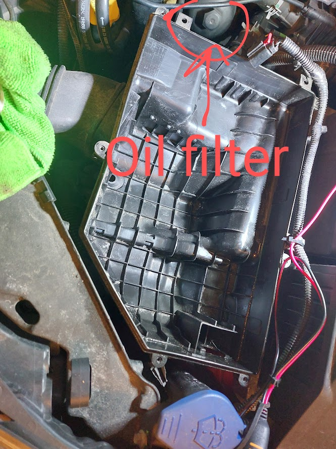
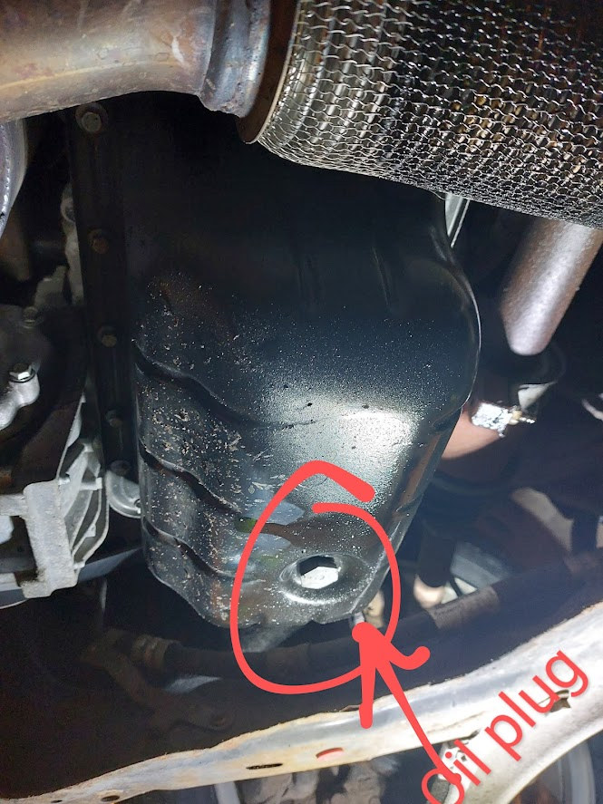

### Reset Oil service warning
You can reset the engine oil service warning without any tools, follow this procedure:
- Inset the key
- Turn the ignition on by pressing the start engine button on, without push on the brake or clutch (the engine should not start)
- Hold the t1/t2 trip button and the start engine button down at the same time until the "i" indication light on the dashboard starts to blink, at this point release both buttons
- At this point the service indication should be reset, verify by turning the ignition of, and then start the car as you normally do.

## Cabin Air filter replacement
This part is not hard, but it is quite annoying and time consuming. The filter is placed on the passenger side under/behind the glove compartment

- Remove the floor carpet 
- Remove 2 torx screws holding a plastic panel behind the glove compartment
- Remove the plastic panel and disconnect the power cable to the floor light
- Disconnect the power cable to the fuse box (blue clip) 
- Remove the fusebox by pushing a plastic clip on the top of the assembly, and pull straight out. You cant pull on the bottom, then you will break something.
- Remove the plastic cover leading to the compartment air filter, 3 clips
- Pull the old filter out
- Insert the new filter, try to not use to many swear words. Make sure to place the filter in the correct orientation, an arrow on the filter should indicate the airflow direction. The arrow should point in to the car.
- Close everything up

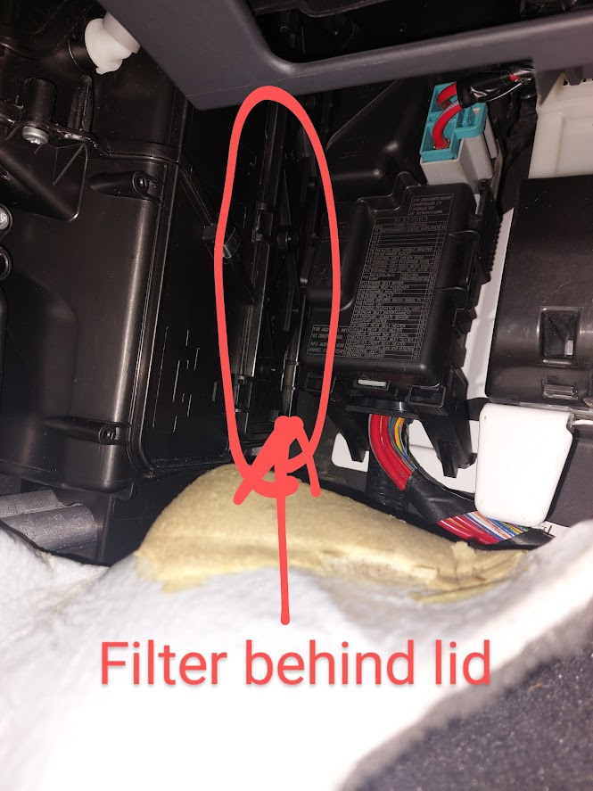
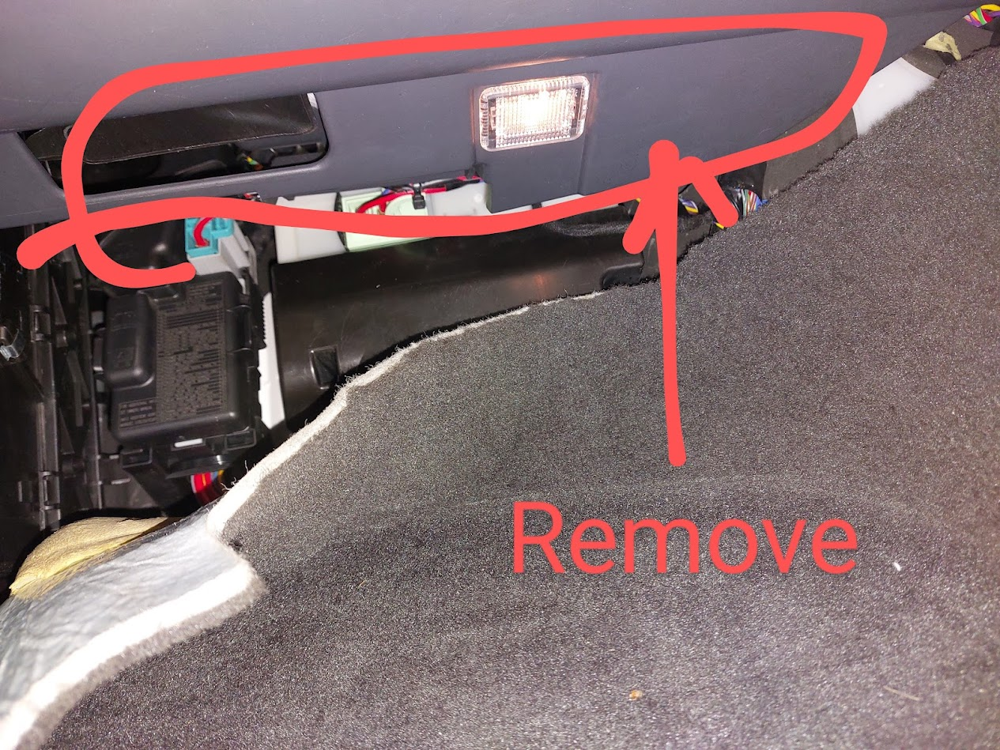
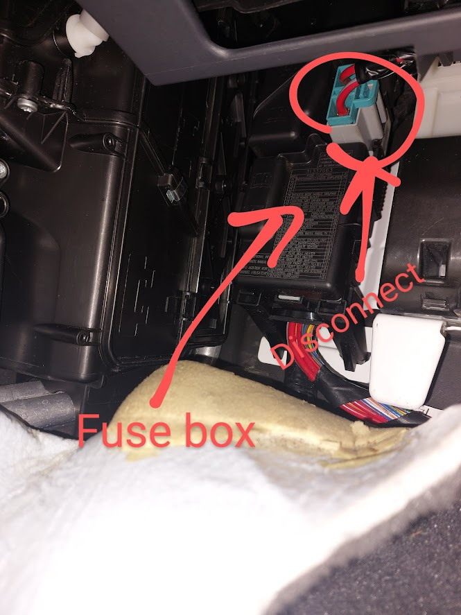
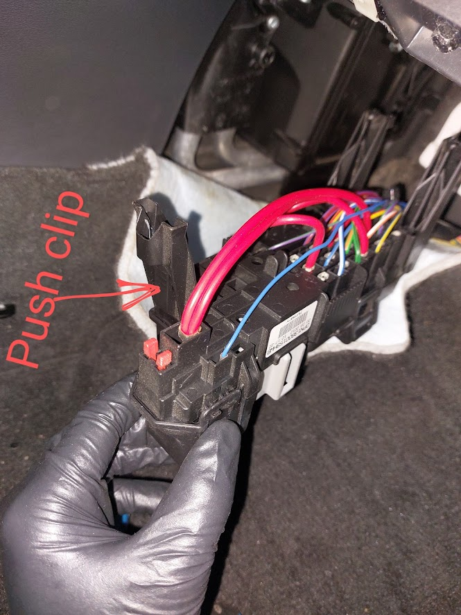

## Draining Disele filter
This is really simple process on this car. The Disele filter is located in the engine compartment, to the right of the engine.

- Find a small jar to collect water and disele. (Tip the lid to a paint spray can is the perfect size)
- Place the jar under the filter
- Turn the lever on top of the filter, and collect waist fluid
- Turn back the lever

It is not uncommon that no fluid is drained from the filter, and nothing to worry about.

## Replacing the Disele filter
No info yet

## Cleaning windscreen in front of active safety / collision detection sensor
Volvo says that the windscreen in front of the collision detection camera should be cleaned ever year / 20000 km during maintenance, however if you can´t see any dust or dirt when looking at the sensors from the outside, then this is most likely unnecessary, a Volvo service center might disagree.

To get to the windscreen in front of the sensor, you have to remove a couple of fairings, for this you need some kind of plastic / nylon bending tool. The collision camera sensor is the left sensor when looking from the outside, standing in front of the car. The right sensor is a rain sensor, we should not touch or try to remove the rain sensor, it is glued directly against the windscreen and has an air tight seal, so no dust or dirt should be able to get there.

Follow this procedure:
- Remove the middle fairing behind the rear view mirror, by bending from the right or left, as the picture shows. There are two plastic tabs holding the fairing.
- Remove the large fairing by bending to the right against the windscreen.
- Pull on the upper clip of the sensor hosing as the picture shows.
- Clean the windscreen whit any glas cleaner of you choice. It is good to use a microfiber towel that is specific for glas, all around microfiber towels tends to leave small hairs on glas.
- Clean the plastic hosing of the sensors if there is dust.
- Reinstall everything, but first make sure that everything is dry, we don´t want any moisture here that can form mist on the glas.

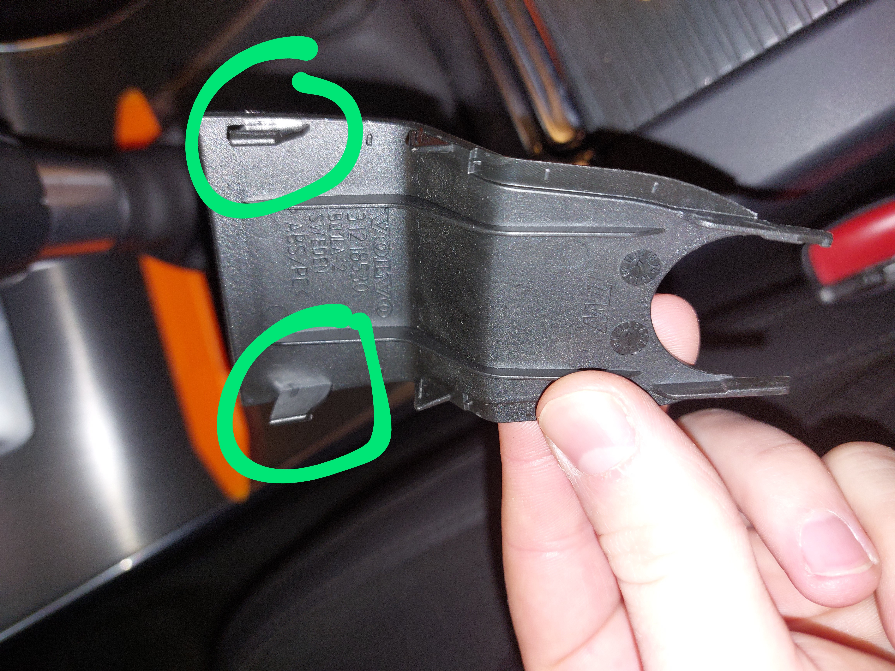

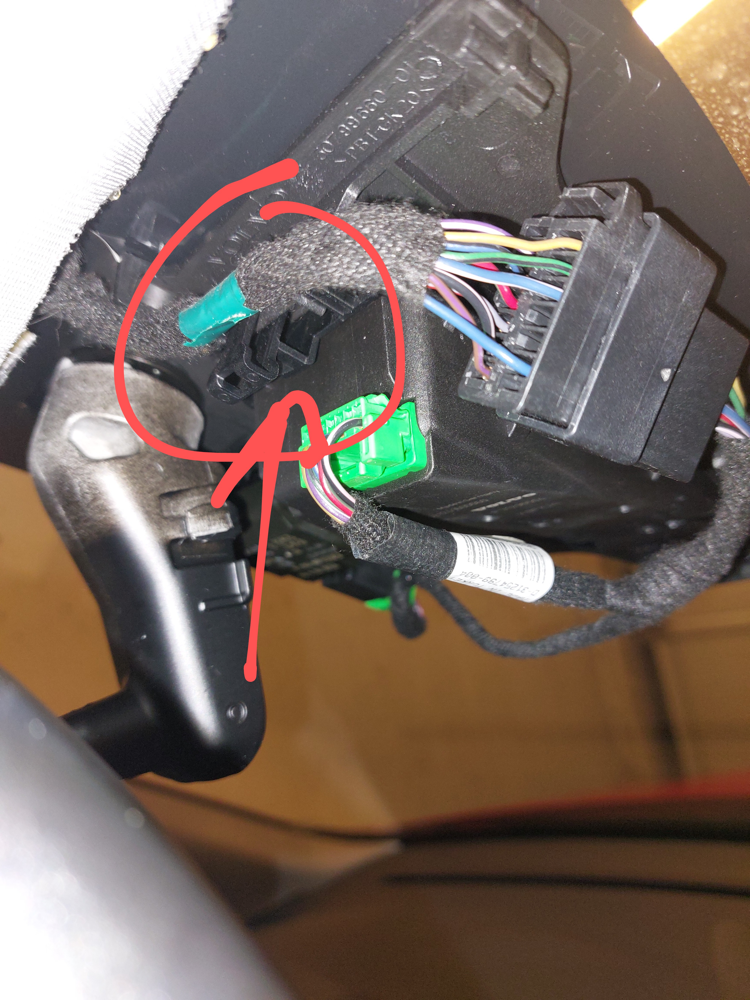
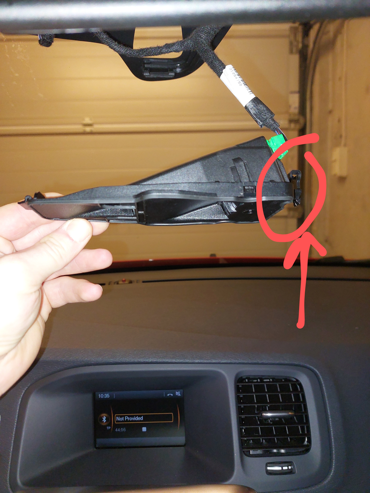

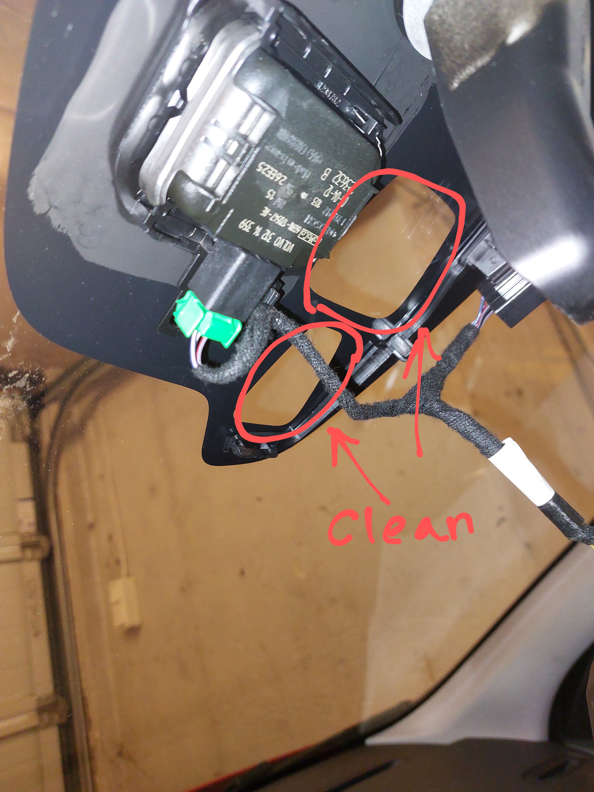

## Inspect Coolant
There are two things that you want to check when it comes to coolant. First is that the levels are okay, the level should be between the min and max line, but it is a good thing to top it up to the max line if it is not already there. Second is to check the freezing properties of the coolant. Volvo recommends that the coolant should be mixed such that it can handle -40&deg;C. If both the level and the freezing properties are good, then you don´t have to do anything. Volvo does not specify any intervals for flushing the coolant system, but if it has not been done within the last 10 years it might be a good thing to do. Changing coolant is quite inexpensive compared to other service items.
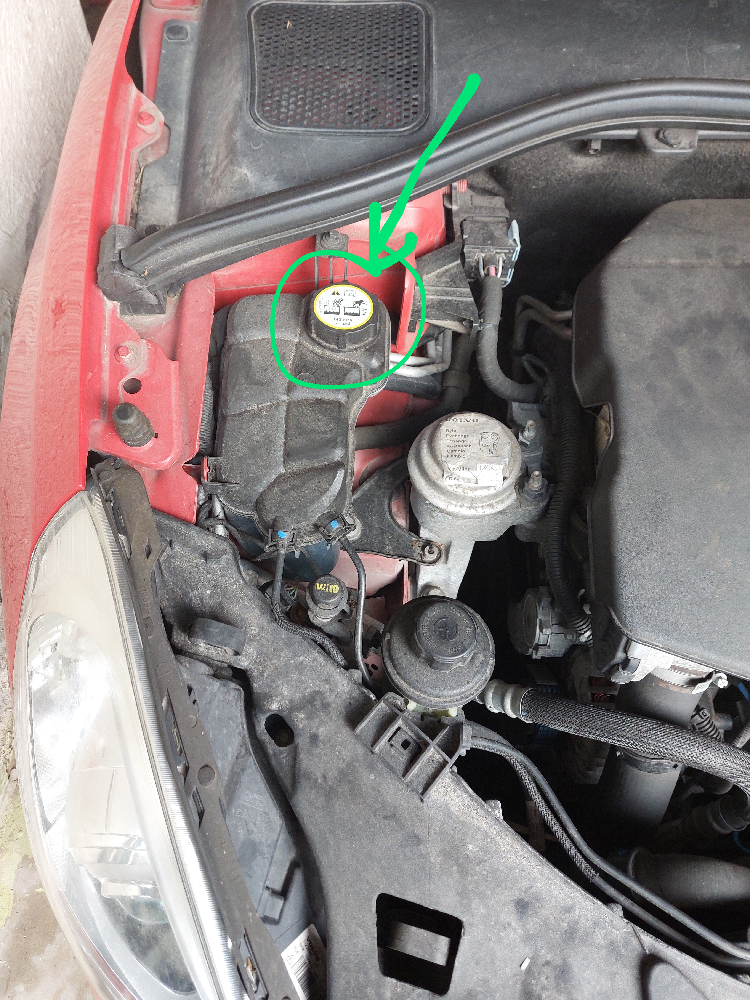

### Checking Coolant Level

### Checking Coolant Freezing Properties
One way to check the freezing properties is to use an refractometer, then you follow this procedure:
- Drip one drop of distilled water / battery water (new) on the prism and adjust / calibrate the refractometer so that line matches up with the water line
- Take a sample of coolant from the car and drip on the prism. (make sure that the prism is clean and free from other fluids)
- Read out the freezing pont, we want to look at the scale for ethylene glycol.

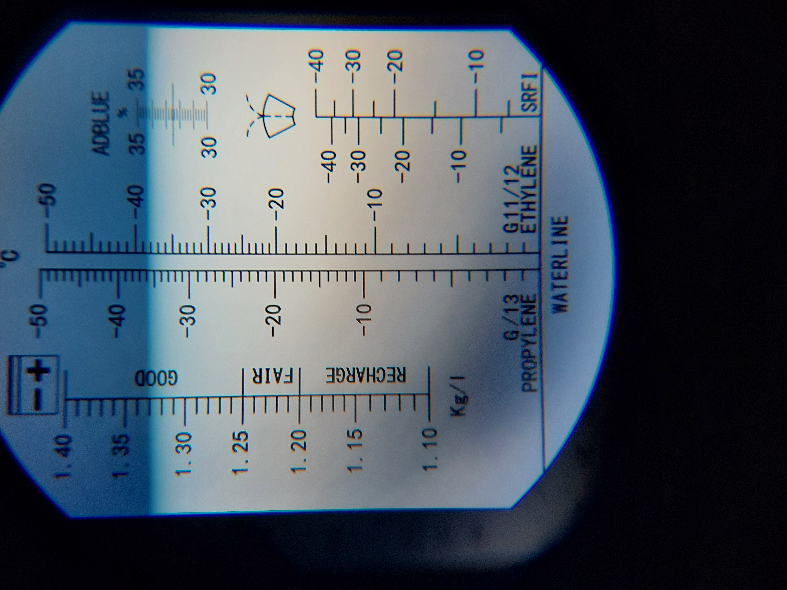

### Adding Coolant / Adjusting Freezing properties
The glykol that should be used is ethylene, it can have different colors, but is usually blue, at least that is the color used by Volvo:s coolant. The mixture should be 50/50 of water and concentrated coolant to achieve a freezing pont of -40&deg; however if your refractometer showed a freezing point that was to low, then you have to add more concentrate and vise versa. It is pointless to do another refractometer test right after adding new coolant, the engine has to be on for a while an mix in the new fluid with the existing fluid. If the coolant is at the max level, but the freezing point is wrong, then you can suck up some coolant from the reservoar and add more water or concentrate, depending on what you need.

You should not use regular tap water, instead you should used demineralized or distilled water, also called battery water. Regular tap water contains minerals like calcium, carbonate, magnesium and manganese, and can form lime scale inside the engine, and can also lead to corrosion. The glycol contains additives to prevent this from happening, but I think it is better to be safe than sorry and use distilled water to mix with the concentrate.

### Flushing / Replacing All Coolant